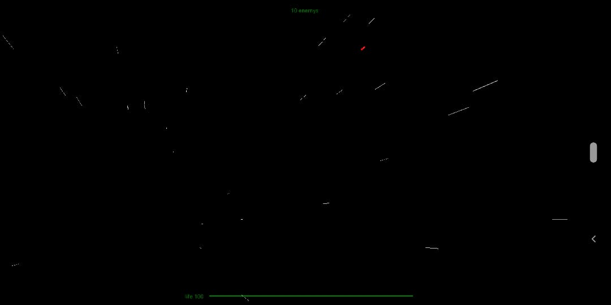

# Taller de interacción

## Propósito

Estudiar las tres tareas universales de interacción en entornos virtuales.

## Tareas

Escoja una de las siguientes tres:

1. Emplee un [dispositivo de interfaz humana](https://en.wikipedia.org/wiki/Human_interface_device) no convencional para controlar una escena. Refiérase al ejemplo [SpaceNavigator](https://github.com/VisualComputing/frames/tree/master/examples/basics/SpaceNavigator). Se puede emplear la escena del [punto 2 del taller de transformaciones](https://github.com/VisualComputing/Transformations_ws)
2. Implemente una aplicación de _cámara en tercera persona_. Refiérase al ejemplo [FlockOfBoids](https://github.com/VisualComputing/frames/tree/master/examples/demos/FlockOfBoids).
3. Implemente una aplicación de _control de la aplicación_ (e.g., ["marking menus"](https://www.youtube.com/watch?v=twR_yxuHw24) o [vistas auxiliares](https://www.youtube.com/watch?v=Kr6-_NT_olo&feature=youtu.be&t=214)).

En cualquier caso se puede emplear la librería [frames](https://github.com/VisualComputing/frames) y/o cualquier otra.

## Integrantes

Máximo tres.

Complete la tabla:

| Integrante | github nick |
|------------|-------------|
|Steven Bustos|stevenbustos|

## Informe

Librerias usadas: [Ketai](http://ketai.org)
Modo usado: [Android Mode](android.processing.org)

Basado en el juego [3DSpaceShooting](www.openprocessing.org/sketch/21754) se cambio para poder ser usado en android.

Los controles pasan de ser movimiento de acuerdo al movimiento del mouse a usarse movimiento usando el acelerometro del
celular, la aceleración y el disparo se logran tocando la pantalla del dispositivo, para ello se uso la libreria Ketai y el
manejo de los sensores del celular.

## Entrega

Fecha límite Domingo 10/3/19 a las 24h.
