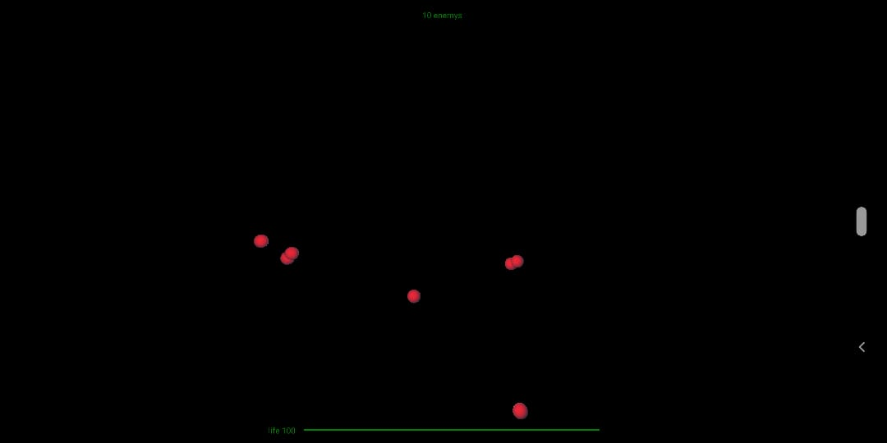
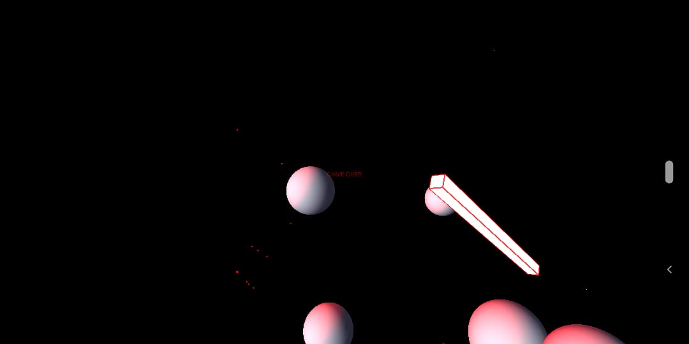

# Taller de shaders

## Propósito

Estudiar los [patrones de diseño de shaders](http://visualcomputing.github.io/Shaders/#/4).

## Tarea

Escoja una de las siguientes dos:

1. Hacer un _benchmark_ entre la implementación por software y la de shaders de varias máscaras de convolución aplicadas a imágenes y video.
2. Estudiar e implementar el [shadow mapping](http://www.opengl-tutorial.org/intermediate-tutorials/tutorial-16-shadow-mapping/). Se puede emplear la escena del [punto 2 del taller de transformaciones](https://github.com/VisualComputing/Transformations_ws), así como la librería [frames](https://github.com/VisualComputing/frames). Ver el ejemplo [ShadowMap](https://github.com/VisualComputing/frames/tree/master/examples/demos/ShadowMap).

## Integrantes

Máximo tres.

Complete la tabla:

| Integrante | github nick |
|------------|-------------|
|Steven Bustos|stevenbustos|

## Informe

Librerias usadas: [Ketai](http://ketai.org)

Modo usado: [Android Mode](android.processing.org)

Basado en el juego [3DSpaceShooting](www.openprocessing.org/sketch/21754) se cambio para poder ser usado en android.

Se usa el mismo juego del [taller anterior](https://github.com/stevenbustos/cv/tree/master/t4/interaction_ws), pero se cambian
las naves enemigas a esferas, al no poderse aplicar texturas a los elementos en Android se usan shaders de iluminación.

Puse una fuente de luz roja en un sitio el cual ilumina a los enemigos al inicio, la nave tiene una iluminación propia de color
blanco, cuando se aproxime a un enemigo le cambiara la tonalidad de roja a blanca.

### Inicio del juego

### Acercamiento

## Entrega

Fecha límite Domingo 10/3/19 a las 24h.
